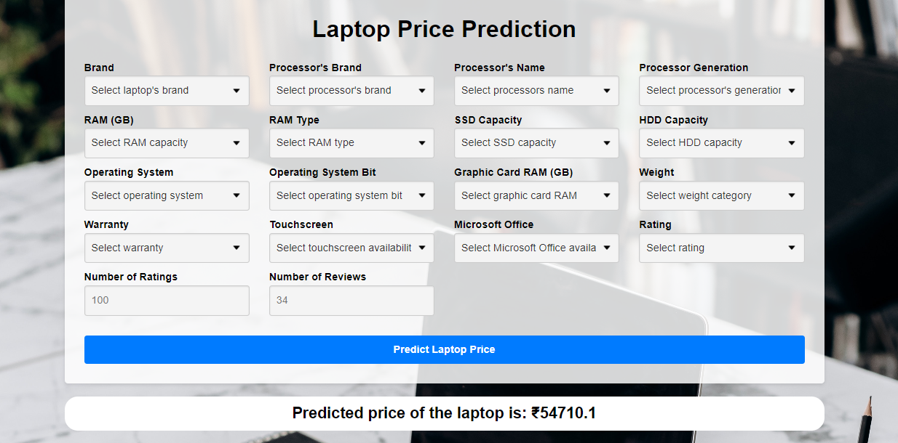

# Laptop Price Prediction

This project aims to predict the price of a laptop based on various features. It utilizes machine learning techniques to train a model and make predictions.

## Project Structure

The project has the following main files and folders:

- `Data`: This directory contains the dataset used for training the model.
- `config`: This directory contains various YAML files for configuration purposes.
- `src`: This directory contains the main source code of the application.
  - `Components`: This directory contains four main components of the application:
    - `data_ingestion.py`: Handles the ingestion of data from the dataset.
    - `data_transformation.py`: Performs necessary data transformations and feature engineering.
    - `data_validation.py`: Validates the input data for prediction.
    - `model_trainer.py`: Trains the machine learning model based on the transformed data.
  - `Config`: 
    - `configuration.py`: Sets up the various file paths which will be needed in the components folder
  - `Entity`: This directory contains two entity files:
    - `model_factory.py`: Responsible for training the model and checking which one performs the best.
    - `prediction.py`: Responsible for performing the prediction on the data coming in from the UI
- `static`: Contains CSS files
- `templates`: Contains HTML files
- `app.py`: The main script to run the web application for predicting laptop prices.
- `pipeline.py`: Script to be run first, responsible for training the machine learning model.
- `requirements.txt`: Contains a list of required Python packages for running the project.

## Getting Started

To run this code locally, follow these steps:

1. Make sure you have Python installed (version 3.0.0 or higher).
2. Install the required packages by running the command: `pip install -r requirements.txt`.
3. Update the `model.yaml` file in the `config` folder if you want to try different models.
4. Run the `pipeline.py` script to train the machine learning model: `python pipeline.py`.
5. Once the model is trained, run the `app.py` script to start the web application: `python app.py`.
6. Access the web application through your browser at `http://localhost:5000`.

